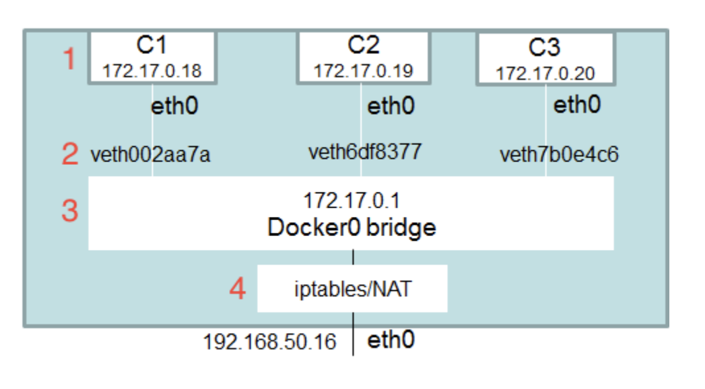

# 4.1 Docker

### Типы пространств имен Linux

В текущей стабильной версии ядра есть семь пространств имен:

- PID: изоляция дерева системных процессов;
- NET: изоляция сетевого стека хоста;
- MNT: изоляция точек монтирования файловой системы хоста;
- UTS: изоляция имени хоста;
- IPC: изоляция утилит межпроцессного взаимодействия (сегменты разделяемой памяти, семафоры);
- USER: изоляция ID пользователей системы;

Контейнеризация не соперничает с виртуализацией - это два разных подхода.

Различия ВМ от контейнера

- Контейнер использует ядро хостовой системы
- Если уязвимость запущена в контейнере то по сути она запущена на хосте!
- В ВМ может работать любая ОС, в контейнере – не
любая
- ВМ хорошо изолируется, контейнер - хуже

### Компоненты и сущности Docker

**Docker daemon** - cерверная часть

- Обеспечивает сборку и запуск контейнеров
- Скачивание образов
- Собирает логи
- Связывает контейнеры по сети
- И т.п.

**Docker CLI** - клиенская часть (может работать локально и по сети)

- Обеспечивает взаимодействие с Docker daemon

**Dockerfile** - инструкция по сборке docker-image

- Практически каждая команда создает новый **слой**

**Docker image** - образ, по которому будет запущен контейнер

- Упакованное приложение
- Хранится в registry
- Состоит из слоев

**Docker container** - работающий экземпляр приложения

**Docker registry** - репозиторий для хранения собранных docker image

### Основные команды

```bash
docker pull mongo

docker images

docker run -p 27017:27017 --name mydb mongo

docker ps

docker exec -it mydb /bin/bash

docker stop mydb

docker rm mydb

docker rmi mongo
```

Docker volumes

```bash
docker run -v /home/mount/data:/var/lib/mysql/data
```


### Сетевое взаимодействие Docker контейнеров

**Docker Network Drivers**

Network Drivers

- None (Отключаем все сети)
- Bridge (контейнеры могут общаться друг с другом)
    * Нельзя вручную назначать ip адреса
    * Нет service discovery
- Host (Использование хостовой сети)
- Overlay (Объединяет сети контейнеров на разных докер хостах)
- Macvlan (Присваивает каждому контейнеру физический MAC-адрес)

Bridge


!!! note

    Встроенный DNS не работает для default bridge

```bash
docker network ls

docker network inspect net_default
```

### Docker compose

```bash
docker-compose up

docker-compose up -d --build

docker-compose down
```

### Docker безопасность

- Не привилегированный пользователь внутри контейнера
- Capabilietes ограничение на вызов отдельных функций ядра (Подробное описание [тут](https://www.opennet.ru/man.shtml?topic=capabilities))
- Встроенные модули безопасности ОС (Apparmor, SELinux)
- Не забываем про ресурсы
- Привыкаем использовать инструменты безопасности контейнеров
- Не используем образы от неизвестных пользователей
- Настройка auditctl для файлов связанных с docker
- Ограничение доступа к docker daemon (tcp, unix socket)
- Стараемся публиковать сервисы в контейнере только на нужном
интерфейсе

```bash
docker scan ubuntu

docker scan --severity=high ubuntu
```

Посмотреть где хранится лог файл
```bash
docker inspect test | grep "LogPath"
```

### Тестирование

Что тестировать?

- Содержимое образа
    * goss - утилита для тестирования инфраструктуры
    * dgoss - обертка на bash, запускающая контейнер из данного образа и выполняющая тесты
- Интеграционное тестирование
- Security
    * Как написано Dockerfile
    * Как запущены контейнеры
    * Что внутри образов
    * **docker-bench-security**


=== ":octicons-file-code-16: `goss.yaml`"

    ```yaml
    command:
     mongod --version | head -n1:
     exit-status: 0
     stdout:
     - db version v3.2.17
    process:
     mongod:
     running: true
    addr:
     tcp://localhost:27017:
     reachable: true
     timeout: 500
    ```

```bash title='healtcheck'
healthcheck:
 test: ["CMD", "curl", "-f", "http://localhost:5000/healthcheck"]
 interval: 1m30s
 timeout: 10s
 retries: 3
```

### Оркестрация

Проблемы

- Рассчитать потребность ресурсов сложно
- Ручное распределение приложений по серверам становится сложной
- Деплой становится рутиной

**Оркестратор**

- Управляет кластером хостов
- Планирование и распределение задач 
- Гибкое управление большим количеством ресурсов
- Нужен контроль над состоянием и ресурсами

**Kubernetes. Основные преимущества**

- Поддержка YAML и JSON форматов
- Поддержка мощного шаблонизатора HELM
- Поддержка множества CNI-плагинов
- Поддержка rolling update, blue-green и canary обновлений, с сохранением истории
- Поддержка автомасштабирований кластера, HPA, VPA
- Возможность подключения систем мониторинга, трассировки, логирования и проч.
- Поддержка service-discovering за счет встроенного DNS-сервиса
- Высокий уровень безопасности, обеспеченный внутренними сервисами с возможностью
расширения
