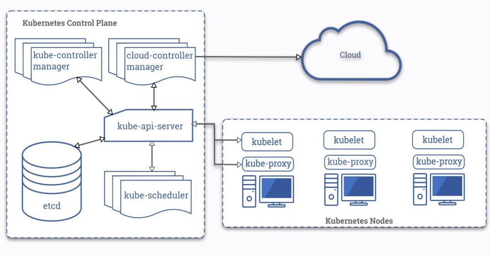

# 5.1 Основные компоненты k8s

### Основные компоненты k8s-кластера:

- etcd – хранилище конфигурации
- api-server – основной компонент API
- controller-manager – запуск набора контроллеров и сборка мусора
- scheduler – назначение подов на ноды с учетом множества факторов

#### **Etcd** – key/value база данных для хранения конфигурации кластера

- Работает по алгоритму raft (он обеспечивает надежность за счет поддержки кворума)
- Единственная база данных для хранения конфигурации, которую поддерживает k8s
- Единственнýй stateful-компонент (который хранит данные в кластере)
- На каждую master-ноду устанавливается по ноде etcd

#### **Api-server** – центральный, главный компонент k8s

- Stateless (в отличии от etcd)
- Взаимодействие через kubectl (но можно работать и просто curl’ом)
- Единственный компонент, который общается с etcd
- Работает по REST API
- Обеспечивает авторизацию и аутентификацию (разграничение прав доступа до содержимому кластера)

#### **Controller-manager** – запускает процессы набора контроллеров

Контроллеры придерживаются принципа единственной ответственности

В состав **controller-manager**’а входят следующие контроллеры:

- node controller - держит связь с нодами кластера, если нода не отвечает, переносит нагрузки на другие ноду
    * kubelet общается с api server, он с controller manager'ом, а уже он общается с node controller'ом
- replicaset controller - смотрит в api-server кластера, видит созданные replicaset’ы, реализует процедуру их создания
- endpoints controller - автоматизация создания эндпоинтов для сервисов (связь между подом и его сервисом)
- account controller - создание стандартных учетных записей
- token controller - создание токенов для доступа API

Обычно, на каждую мастер-ноду устанавливают по одному экземпляру **controller-manager**.
Но, одновременно может работает только один лидирующий **controller-manager**, и выбор лидера происходит по алгоритму lease
Суть алгоритма lease очень проста – тот, кто первым успеет записать себя лидером в api-server тот и лидер
Если текущий лидер не будет отвечать нужное время, борьба за лидерство возобновится по тому же принципу

#### **Scheduler** назначает поды на ноды с учетом множества факторов

**controller-manager** генерирует манифесты подов, записывает данные в api-server, а scheduler назначает их на ноды, но учитывает важные параметры:

- QoS (quality of service)
- Affinity и Anti-affinity
- Requests и Limits
- Priority Class (preemption)

### Вспомогательные компоненты k8s

Помимо основных компонентов, установленных на мастер-нодах, для работы кластера необходимы дополнительные компоненты, которые устанавливаются на всех нодах (мастеры и воркеры):

**kubelet** – агент, работающий на узле кластера

- Работает на каждой ноде (и мастеры и воркеры)
- Не запускается в докере, работает как процесс на хосте (systemctl status kubelet)
- Отдает команды docker daemon через docker api (docker run, напр.)
- Фактически реализует запуск подов на узле
- Обеспечивает проверки liveness probe, readiness probe, startup probe

**Startup probe** – используется для проверки, что приложение в контейнере было запущено. Если проба настроена, то liveness и readiness проверки блокируется, до того как проба пройдет успешно
^^(контейнер в статусe running)^^

**Readiness probe** – используется для проверки, доступен ли модуль в течение всего жизненного цикла. В отличие от liveness probe, в случае сбоя проверки останавливается только трафик к модулю, но перезапуска не происходит 
^^(само приложение внутри контейнера готово обрабатывать соединения)^^

**Liveness probe** – используется для определения, когда контейнер необходимо перезапустить 
^^(когда приложение уже работает, раз в какое то время проверяем его)^^

**kube-proxy** - сетевой прокси, работающий на каждом узле в кластере

- Взаимодействует с api-server
- Устанавливается на всех нодах
- Управляет сетевыми правилами на нодах
- Запускается в контейнере

Второстепенные компоненты, с которыми вы столкнетесь при работе с кластером k8s:

- cri (движок процесса контейнеризации)
- cni (сетевые плагины)
- dns (k8s-совместимые dns-серверы)
- ccm (controller-manager для облачных решений)

