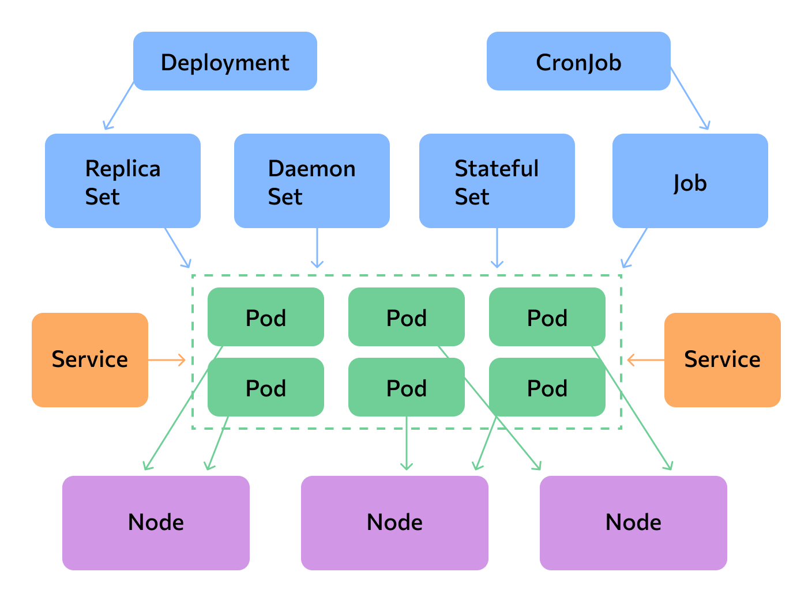
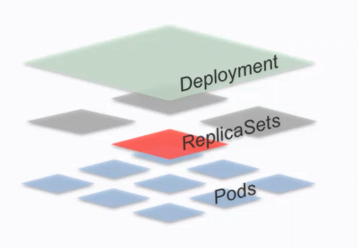

# 5.2 Основные объекты кластера K8s

### Deployment, ReplicaSet, Pod



Контроллер развертывания (deployment controller) предоставляет функционал декларативного описания и обновления для рабочих нагрузок

В своей работе Deployment использует концепцию репликасетов (ReplicaSet), задействуя replicaset controller



Функционал деплоймента тесно связан с сущностью replicaset

Основная задача ReplicaSet - поддержание стабильного набора репликаций подов, работающих в один момент времени
ReplicaSet гарантирует доступность заданного количества идентичных подов

За счет гарантированного поддержаниā определенного количества идентичных подов, ReplicaSet позволяет выполнять следующие операции в кластере:

- Обновление (rolling update)
- Просматривать информацию о текущем обновлении (rollout status)
- Откат обновления (rollout undo)
- История ревизий обновлений (rollout history)
- Откат (роллбук) до конкретной ревизии обновления (rollout undo to revision)
- Скалирование рабочих нагрузок (scaling)


```bash
kubectl create ns mobsf

kubectl create deployment mobsf --image=opensecurity/mobile-security-framework-mobsf:v3.1.1 -n mobsf

kubectl expose deployment mobsf --port=8000 --type=NodePort -n mobsf

kubectl get svc -n mobsf

kubectl get pods -n mobsf

kubectl desctibe replicaset -n mobsf

# Статус обновления
kubectl rollout status deployment/mobsf -n mobsf

# Отменить обновление
kubectl rollout undo deployment/mobsf -n mobsf

# Просмотр истории
kubectl rollout history deployment/mobsf -n mobsf

# Откат на конкретную версию
kubectl rollout undo deployment/mobsf -n mobsf --to-revision=3

kubectl scale deployment/mobsf --replicas=3 -n mobsf
```

### Работа с данными в Kubernetes

**PersistentVolume (PV)** - непосредственно система хранения данных (раздел на жестком диске)

С точки зрения кластера, Persistent Volume является таким же ресурсом, как, к примеру, Worker Node

Работатать с PV (создавать/читать/изменять/удалять) можно через манифест

**PersistentVolumeClaim (PVC)** - это запрос на выделение рабочей нагрузке PersistentVolume (PV)

С помощью PVC можно управлять хранилищем рабочей нагрузки путем выделения и подключения к подам дисков с заданными характеристиками

PVC подключается к подходящему PV, который может быть создан из манифеста, или создан автоматически посредством провижининга

Запрос на PVC располагается в манифесте деплоймента вашей рабочей нагрузки

- Deployment содержит запись о необходимости использования PVC
- PVC содержит требования к хранилищу (PV)
- PV вручную создается или провижинится автоматически в кластере
